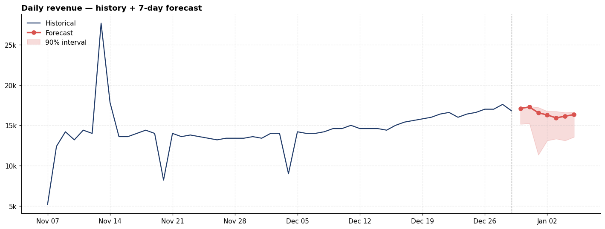

# Restaurant daily revenue forecasting



Forecasting the next 7 days of revenue for a small multi-city restaurant group, end-to-end in one notebook.

I rebuilt this from an earlier messy version that had some EDA, an ANOVA, a chi-square test, and a broken regression cell predicting price (which is basically determined by product and not a real prediction task). This version treats it as a daily-revenue forecasting problem, which is what the business actually needs.

## What it does

Takes the raw transaction-level CSV, rolls it up to daily revenue, runs the usual time-series diagnostics, and compares five models against each other: three baselines (naive, seasonal naive, 7-day moving average) and two ML models (Ridge, Gradient Boosting with lag features). Ends with a 7-day forecast with 90% prediction intervals from quantile regression.

## Results (and the lesson here)

On my run, the baselines won. All three of them beat both ML models on holdout MAE, and the plain "tomorrow = today" naive forecast came out on top:

| Model | MAE |
|---|---|
| Naive (lag-1) | 371 |
| Moving Avg (7) | 676 |
| Seasonal Naive (lag-7) | 1071 |
| Gradient Boosting | 2669 |
| Ridge | 2829 |

This is the opposite of what I expected going in, and it's worth writing down why it happened rather than hiding it.

Two things are going on. First, 53 days is a tiny training window, and the ML models are burning their degrees of freedom learning patterns that don't generalize. Second, the day-to-day autocorrelation in this series is high enough that `lag_1` is genuinely hard to beat — adjacent days share a lot of noise, so "yesterday's value" is a surprisingly strong signal.

The practical takeaway: on small datasets, don't assume a fancier model is a better model. Start with the naive forecast, and make anything more complex earn its place. If I'd skipped the baselines and just reported the gradient boosting MAE, this would look like a reasonable result. Against the baseline, it's a regression.

## Running it

```bash
pip install -r requirements.txt
jupyter notebook RestaurantSales.ipynb
```

The notebook is pre-executed so you can just browse it on GitHub. Runs end-to-end in under 30 seconds.

## Data

The dataset is [Restaurant Sales Data](https://www.kaggle.com/datasets/rohitgrewal/restaurant-sales-data) by Rohit Grewal on Kaggle. 254 transaction-level records across 53 days (November–December 2022), five cities, five product categories. It's licensed under the dataset's own Kaggle terms — check the link before redistributing.

The `salesr.csv` in this repo is the original file, unchanged. If you want to run it yourself, you can either use the copy here or download it fresh from Kaggle.

## Caveats

A few things I'd call out if someone asked me about this in an interview:

53 days is not enough data to say anything about yearly seasonality, holiday effects, or long-term trend. Those are probably real and probably important for a restaurant, and they're sitting in the residuals I can't untangle.

The prediction intervals come from quantile gradient boosting. Empirical coverage on a sample this small is very likely worse than the nominal 90%. I wouldn't hand these to a manager making inventory decisions without back-testing first.

Missing calendar days are treated as closed-business days with zero revenue. If they're actually data-entry gaps, that inflates the weekly seasonality estimate. A conversation with whoever owns the data would clear this up.

## Repo layout

restaurant-sales-forecasting/
├── assets/
│   └── forecast.png
├── .gitignore
├── requirements.txt
├── README.md
├── notebooks/
│   └── restaurant-sales-forecasting.ipynb
└── data/
    └── salesr.csv 

## What I'd do next

Per-city forecasts reconciled to the aggregate, since store-level numbers are more useful to managers than a single group total. Weather and public-holiday features, which are cheap to add and genuinely predictive for restaurants. And once there's a year of data, move to a proper forecasting framework — probably statsforecast or sktime — and revisit the model comparison.

## Stack

Python, pandas, scikit-learn, matplotlib, scipy. Nothing beyond what sklearn provides for modeling. No statsmodels, no Prophet, no neural networks. That's deliberate given the sample size.
